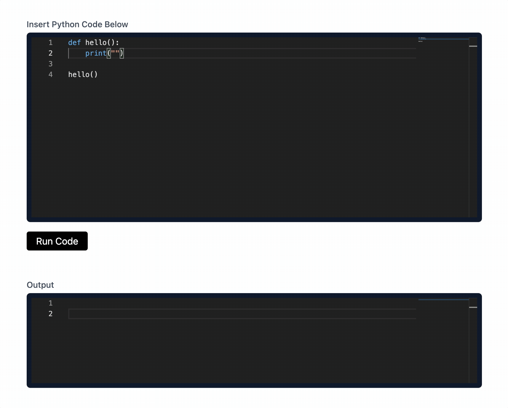

# run-wasm

[run-wasm](https://www.runwasm.com) is an easy to use tool for running WASM based code executions in the browser.

Brought to you by [Slip](https://www.slip.so) and our amazing OSS contributors.

## Goal of the project

The goal of this project is to build an easy way to execute various programming languages in the browser via WebAssembly.

People should be able to use this project to embed executable code snippets on their websites easily!

We're building this as a new component to be used inside the [Slip](https://www.slip.so) authoring tool.

## All Contributors ✨

Thanks goes to these wonderful people.

<!-- ALL-CONTRIBUTORS-LIST:START - Do not remove or modify this section -->
<!-- prettier-ignore-start -->
<!-- markdownlint-disable -->
<table>
  <tr>
    <td align="center"><a href="https://www.slip.so/"> <b>kennethcassel</b></a> <a href="https://github.com/slipHQ/run-wasm/commits?author=kennethcassel" title="Code">💻</a></td>
    <td align="center"><a href="https://github.com/nikolaystrikhar"> <b>Nikolay Strikhar</b></a> <a href="https://github.com/slipHQ/run-wasm/commits?author=nikolaystrikhar" title="Code">💻</a></td>
    <td align="center"><a href="https://github.com/mcintyre94"> <b>Callum McIntyre</b></a> <a href="https://github.com/slipHQ/run-wasm/commits?author=mcintyre94" title="Code">💻</a></td>
    <td align="center"><a href="https://github.com/bharat-patodi"> <b>Bharat Patodi</b></a> <a href="https://github.com/slipHQ/run-wasm/commits?author=bharat-patodi" title="Code">💻</a></td>
    <td align="center"><a href="https://codingknite.com/"> <b>Joel P. Mugalu</b></a> <a href="https://github.com/slipHQ/run-wasm/commits?author=codingknite" title="Documentation">📖</a></td>
    <td align="center"><a href="https://vimforvscode.com"> <b>Joe Previte</b></a> <a href="https://github.com/slipHQ/run-wasm/commits?author=jsjoeio" title="Documentation">📖</a> <a href="https://github.com/slipHQ/run-wasm/commits?author=jsjoeio" title="Code">💻</a> <a href="#content-jsjoeio" title="Content">🖋</a></td>
    <td align="center"><a href="https://github.com/ntindle"> <b>Nicholas Tindle</b></a> <a href="https://github.com/slipHQ/run-wasm/commits?author=ntindle" title="Code">💻</a></td>
  </tr>
  <tr>
    <td align="center"><a href="http://dhaiwat.com"> <b>Dhaiwat Pandya</b></a> <a href="https://github.com/slipHQ/run-wasm/commits?author=Dhaiwat10" title="Code">💻</a></td>
    <td align="center"><a href="https://github.com/allstargaurav"> <b>Gaurav</b></a> <a href="https://github.com/slipHQ/run-wasm/commits?author=allstargaurav" title="Code">💻</a></td>
    <td align="center"><a href="http://pierreouannes.com"> <b>PierreO</b></a> <a href="https://github.com/slipHQ/run-wasm/commits?author=pouannes" title="Code">💻</a></td>
    <td align="center"><a href="https://github.com/devonzara"> <b>Devon Zara</b></a> <a href="https://github.com/slipHQ/run-wasm/commits?author=devonzara" title="Code">💻</a></td>
    <td align="center"><a href="https://github.com/KagenLH"> <b>Kagen Hearn</b></a> <a href="https://github.com/slipHQ/run-wasm/commits?author=KagenLH" title="Code">💻</a></td>
    <td align="center"><a href="https://cameron.sh/"> <b>Cameron Moreau</b></a> <a href="https://github.com/slipHQ/run-wasm/commits?author=cameronmoreau" title="Code">💻</a></td>
    <td align="center"><a href="https://www.mohdshadab.com/"> <b>Shadab</b></a> <a href="https://github.com/slipHQ/run-wasm/commits?author=shadab14meb346" title="Code">💻</a></td>
  </tr>
  <tr>
    <td align="center"><a href="https://bitwiser.in"> <b>Brijesh Bittu</b></a> <a href="https://github.com/slipHQ/run-wasm/commits?author=brijeshb42" title="Code">💻</a></td>
    <td align="center"><a href="https://github.com/octokatherine"> <b>Katherine Peterson</b></a> <a href="https://github.com/slipHQ/run-wasm/commits?author=octokatherine" title="Code">💻</a></td>
  </tr>
</table>

<!-- markdownlint-restore -->
<!-- prettier-ignore-end -->

<!-- ALL-CONTRIBUTORS-LIST:END -->
